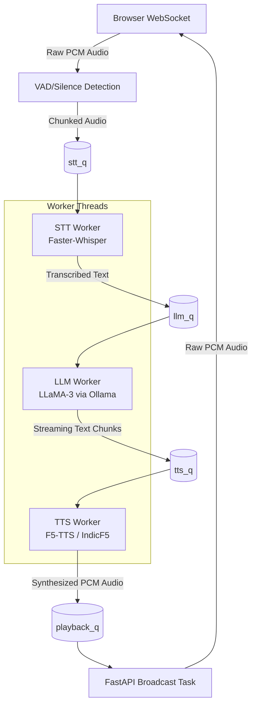

# System Architecture 🏗️

The **Speech-to-Speech Light** pipeline is built around a non-blocking, multi-threaded asynchronous architecture to ensure the lowest possible latency for conversational AI.

## High-Level Data Flow

1. **Client (Browser):**
   - Captures microphone input.
   - Streams raw `float32` PCM audio bytes via WebSockets to the server.
   - Plays back `float32` PCM audio chunks received from the server.

2. **Server (FastAPI - `server.py`):**
   - Accepts WebSocket connections.
   - Performs **Voice Activity Detection (VAD)** by calculating the RMS volume of the incoming audio stream.
   - Accumulates audio while the user is speaking. Once 1.5 seconds of silence is detected, the audio chunk is pushed to the STT Queue.
   - An asynchronous `broadcast_playback` task continually pulls generated audio from the Playback Queue and sends it back to the client.

3. **AI Workers (`agent.py`):**
   The core intelligence of the system is split across three dedicated daemon threads. They communicate using thread-safe `queue.Queue` objects.

## Component Details

### 1. STT Worker (Speech-to-Text)
- **Model:** `faster_whisper` (large-v3, Int8 quantized, CUDA).
- **Function:** Reads arrays from `stt_q`, transcribes them, and forwards the recognized text to the LLM.

### 2. LLM Worker (Large Language Model)
- **Model:** `llama3:8b` running via a local Ollama server.
- **Function:** Receives text from the user, appends it to a short-term conversational history, and streams the generation token-by-token. 
- **Chunking Logic:** Tokens are accumulated in a buffer. When a punctuation boundary (e.g., `.|?|!|,`) is hit AND the minimum word count threshold is reached, the buffer is flushed to the `tts_q`. This prevents the TTS engine from waiting for the entire LLM response to finish before speaking.

### 3. TTS Worker (Text-to-Speech)
- **Model:** `F5-TTS` (DiT/CFM based architecture) utilizing custom Bengali weights (`model.safetensors`).
- **Function:** Reads sentences from `tts_q` and synthesizes them into audio using zero-shot voice cloning against a reference audio file. The resulting numpy float array is normalized and pushed to the `playback_q`.

## Lifecycle & Shutdown
- The worker threads are spawned as `daemon=True`.
- When `Ctrl+C` is pressed, FastAPI's `@app.on_event("shutdown")` handler fires.
- A "poison pill" `(None, None)` is injected into `playback_q`, cleanly terminating the async `broadcast_playback` coroutine.
- The Python runtime then cleanly kills the daemon worker threads upon exit.
